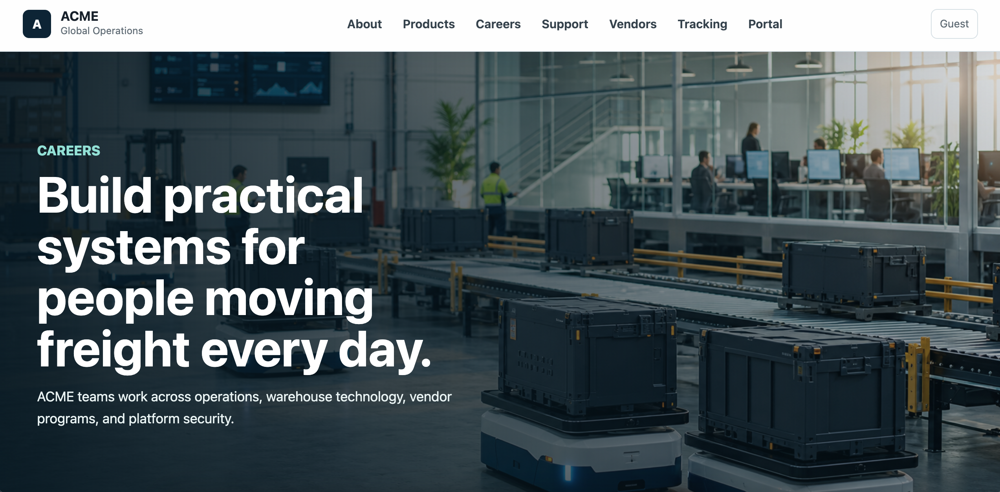

# 7 ATT&CKs in 7 Weeks

A local-first **7-week red-team learning course** inspired by MITRE ATT&CK, built around a fictional company target named **ACME**.



The repository includes:

- A structured weekly curriculum for practicing one red-team focus area at a time.
- A local-only fictional target company named **ACME**.
- A no-dependency Python web app that can be launched on your workstation for safe practice.
- Notes, rules of engagement, and evidence folders to keep each week organized.

> This project is for authorized local training only. Do not use these exercises against systems you do not own or have explicit permission to test.

## Repository Structure

```text
.
├── docs/                     # Program overview, rules, and lab guidance
├── labs/                     # 7-week learning course and evidence folders
├── scripts/                  # Helper scripts for launching and testing the local target
└── target-site/acme/         # Fictional ACME local web target
```

## Quick Start

Launch the ACME target locally:

```bash
./scripts/run_acme.sh
```

Then browse to:

```text
http://127.0.0.1:8000
```

The app is intentionally lightweight and runs with Python's standard library. No package install is required.

## ACME Target Site

The fictional ACME site resembles a small business portal with public pages, employee login, a support contact form, a vendor portal, and internal-looking resources. It is intentionally designed for local training workflows such as:

- Reconnaissance and site mapping.
- Vulnerability assessment and false-positive review.
- Controlled exploitation planning.
- Post-exploitation impact analysis.
- Command-and-control concept discussions in a lab context.
- Red-team operations planning.
- Evasion and detection-engineering reflection.

The target site is **not** intended to be internet-facing. Keep it bound to localhost unless you are deliberately running it in an isolated lab network.

## Generated Content Note

The fictional ACME website content and local image assets in this repository were generated with GPT-codex for authorized training and lab use.

## 7-Week Learning Course

| Week | Focus Area | Core Skills | Primary Tools | Outcome |
| --- | --- | --- | --- | --- |
| 1 | Reconnaissance | OSINT, domain research, infrastructure mapping | Amass, Shodan, WHOIS, Google dorking | Build a target profile ethically |
| 2 | Vulnerability Assessment | Network/web scanning, false-positive review | Nmap, OWASP ZAP, Nikto | Identify and validate weaknesses |
| 3 | Exploitation | Lab exploitation, chaining vulnerabilities | Metasploit, Burp Suite | Exploit controlled lab targets safely |
| 4 | Post-Exploitation | Privilege escalation, lateral movement concepts | BloodHound, Mimikatz, LinPEAS/WinPEAS | Understand impact after compromise |
| 5 | Command & Control | C2 architecture, covert channels, detection awareness | Empire, Mythic | Learn C2 concepts in a lab |
| 6 | Red Team Operations | Campaign planning, adversary emulation | ATT&CK, Atomic Red Team | Run a structured red-team simulation |
| 7 | Advanced Evasion | Defense evasion concepts, LOLBins, detection engineering | Sysinternals, LOLBins, custom scripts | Understand evasion and blue-team detection |

Start with [`docs/program-plan.md`](docs/program-plan.md), review [`docs/tooling-notes.md`](docs/tooling-notes.md), then work through Weeks 1–7 in [`labs/`](labs/).

## Safety Guardrails

- Run the ACME target locally only.
- Keep testing traffic pointed at `127.0.0.1` or an explicitly authorized lab host.
- Treat tools in the schedule as learning references; configure them only for local or explicitly authorized targets.
- Capture notes and evidence in this repo instead of running destructive activity.
- Treat all sample credentials, flags, and company data as fictional.
