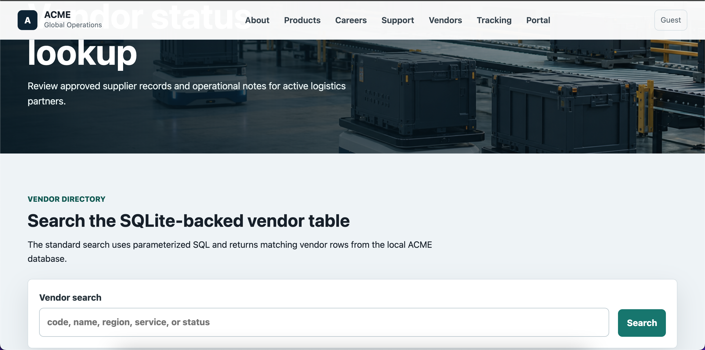

# ACME Target Site Guide

## Launch

```bash
./scripts/run_acme.sh
```

The helper starts the app from `target-site/acme/app/server.py` and binds it to `127.0.0.1:8000` by default.

Optional environment variables:

| Variable | Default | Purpose |
| --- | --- | --- |
| `ACME_HOST` | `127.0.0.1` | Bind address |
| `ACME_PORT` | `8000` | TCP port |

Example:

```bash
ACME_PORT=8080 ./scripts/run_acme.sh
```

## Reset the Lab

Stop the ACME site with `Ctrl+C`, then clear generated tickets, request logs, and database activity with:

```bash
./scripts/reset_acme.sh
```

The reset script keeps the source files and `.gitignore` in place. The next launch creates a fresh database with the starter vendor and shipment records. If ACME is still running, the script will stop without deleting anything.

## Pages to Explore

| Path | Purpose | Useful Weeks |
| --- | --- | --- |
| `/` | Public homepage | 1, 2 |
| `/about` | Company profile | 1, 6 |
| `/products` | Product details | 1, 6 |
| `/careers` | Hiring page | 1, 6 |
| `/support` | Support request form | 2, 3 |
| `/login` | Staff and vendor login | 2, 3, 4 |
| `/portal` | Authenticated user portal | 4, 6 |
| `/vendor` | SQLite-backed vendor lookup and SQL training lab | 2, 3, 6 |
| `/shipments` | SQLite-backed shipment tracking search | 2, 3, 4, 6 |
| `/portal/shipment?id=1` | Authenticated shipment detail with owner/admin access checks | 3, 4 |
| `/portal/shipment?id=4&mode=lab` | Local-only IDOR comparison mode | 3, 4, 7 |
| `/admin/tickets` | Admin support queue and stored XSS comparison lab | 3, 4, 7 |
| `/admin/activity` | Admin audit event view for blue-team reflection | 4, 6, 7 |
| `/internal/config` | Fake legacy config and recon breadcrumb page | 1, 2, 6 |
| `/lab-notes` | Deliberately exposed training hints | 1, 7 |
| `/health` | JSON health endpoint | 2 |

## Local Data

The app stores request logs, support tickets, and the generated SQLite database under `target-site/acme/data/`. These files are useful for evidence collection and blue-team reflection throughout the 7-week course.

## Vendor SQLite Lab

The vendor page seeds a local SQLite database with fictional supplier records the first time the app starts. The standard vendor search uses parameterized SQL. The same page also includes a clearly labeled SQL training lab panel that intentionally builds a vulnerable query for local-only injection testing and comparison.



Do not point SQL tooling or payloads at systems outside this local lab.

## Shipment and IDOR Lab

The shipment tracking page adds a second SQLite-backed table for testing search workflows and access-control assumptions. Shipment detail pages require login and normally allow the assigned user or an administrator. The `mode=lab` query string intentionally bypasses that check so you can compare expected authorization behavior with an insecure direct object reference pattern in a safe local target.

## Admin and XSS Lab

The support form writes local ticket data to `target-site/acme/data/support_tickets.jsonl`. Administrators can review tickets at `/admin/tickets`, where the standard table escapes ticket messages and the clearly labeled stored XSS lab preview intentionally renders the latest messages without escaping. Use only harmless local test payloads and document the safe-versus-vulnerable output.

The `/admin/activity` page reads local audit events from SQLite and is useful for connecting logins, denied shipment access, lab-mode views, support ticket creation, and admin review activity to blue-team observations.

## Recon Breadcrumbs

`/robots.txt`, `/lab-notes`, `/internal/config`, and the client-side `window.ACME_BUILD` object intentionally expose fake training metadata. Values such as `FAKE_ACME_DEMO_KEY_DO_NOT_USE` are not secrets; they are included so you can practice separating true findings from false positives.
