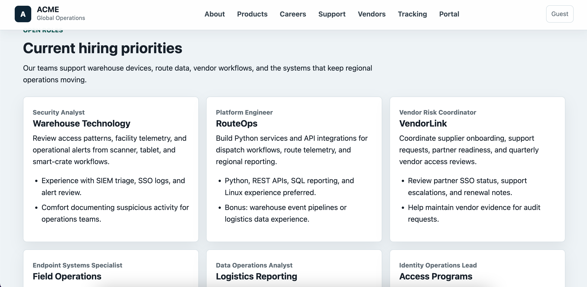

# Week 01 — Reconnaissance

## Focus Area

Reconnaissance

## Core Skills

- OSINT.
- Domain research.
- Infrastructure mapping.

## Primary Tools

- Amass.
- Shodan.
- WHOIS.
- Google dorking.

## Outcome

Build a target profile ethically.

## Local ACME Tasks

- Map public ACME routes without logging in.
- Review page titles, forms, links, footer links, and visible technology clues.
- Review `robots.txt` and any deliberately exposed lab notes.
- Build an ethical target profile that clearly states localhost scope.

## Deliverable

A target profile with screenshots or command output in `evidence/`.
