# ACME Infrastructure Mapping and Defensive Review

## 1. Scope Confirmation

This Day 6 review is limited to the local ACME lab at `127.0.0.1:8000` and the fictional `acme-training.test` records provided in the course. I did not resolve, scan, or connect to any fictional hostname or third-party system.

The local ACME site is in scope. Fictional hostnames may be discussed as passive findings, but they are not live targets. Names under vendor domains are out of scope unless separate written authorization is provided.

Confidence labels used in this report:

- Confirmed: Directly observed in the local lab.
- Probable: Supported by more than one passive clue.
- Possible: Plausible, but supported by limited evidence.
- Inferred: Guessed from a route name or naming pattern.

## 2. Source Summary

| Source | Data Used | Limitations |
|---|---|---|
| Day 1 scope sheet | Local target, allowed methods, and authorization boundaries | Does not prove that any fictional hostname exists |
| Day 2 DNS and certificate profile | Fictional DNS records, certificate names, mail routing, vendor CNAMEs, and local HTTP identity | Records were supplied for the exercise and were not resolved |
| Day 3 search OSINT | Public routes, `robots.txt`, JavaScript clues, product names, and careers terms | Route and technology clues do not confirm matching hostnames or production use |
| Day 4 exposure intelligence | Fictional service records, product banners, and observation dates | Passive records may be old, incomplete, or wrong |
| Day 5 subdomain enumeration | Normalized hostnames, source correlation, and third-party separation | Amass-style output was provided data, not a live Amass result |

## 3. Consolidated Asset Map

| Asset | Category | Evidence Sources | Confidence | Scope Status | Notes |
|---|---|---|---|---|---|
| `127.0.0.1:8000` | Local web lab | Direct HTTP and listener checks | Confirmed | In scope | ACME training site bound to loopback only |
| `www.acme-training.test` | Public web | DNS, certificate, Amass-style | Probable | Passive only | Public website name; not checked live |
| `status.acme-training.test` | Public web | DNS, Amass-style | Probable | Passive only | Points toward a hosted status provider in the fictional records |
| `portal.acme-training.test` | Portal/access | DNS, certificate, exposure, Amass-style | Probable | Passive only | Recent passive exposure record; current state unverified |
| `api.acme-training.test` | API | DNS, certificate, exposure, Amass-style | Probable | Passive only | Most recent passive exposure record in Day 4 |
| `legacy-api.acme-training.test` | Legacy API | Certificate, TLS name, Amass-style | Probable | Historical, passive only | No current DNS record was provided |
| `vendorlink.acme-training.test` | Application | Amass-style, public product name | Possible | Passive only | Product match supports purpose, not current use |
| `routeops.acme-training.test` | Application | Amass-style, public product name | Possible | Passive only | Product match supports purpose, not current use |
| `cratecloud.acme-training.test` | Application | Amass-style, public product name | Possible | Passive only | Product match supports purpose, not current use |
| `sso.acme-training.test` | Identity/access | Amass-style, careers SSO clue | Possible | Passive only | Identity lead needs validation |
| `vpn.acme-training.test` | Remote access | DNS, certificate, exposure, Amass-style | Probable | Passive only | High-value function with an aging exposure record |
| `mail.acme-training.test` | Email | MX record, Amass-style | Probable | Passive only | Fictional ACME mail-routing name |
| `dev.acme-training.test` | Development | DNS, vendor CNAME, stale exposure, Amass-style | Probable | Passive only, vendor boundary | Current state is unknown |
| `qa-api.acme-training.test` | Non-production API | Amass-style | Possible | Passive only | Single hostname source |
| `staging-portal.acme-training.test` | Non-production portal | Certificate, stale exposure, Amass-style | Probable | Historical, passive only | Old exposure record; no current DNS provided |
| `admin.acme-training.test` | Administration | Local `/admin` routes | Inferred | Unknown | Route-derived guess, not a confirmed hostname |
| `internal.acme-training.test` | Internal service | Local `/internal/config` route | Inferred | Unknown | Route-derived guess, not a confirmed hostname |
| `shipments.acme-training.test` | Application | Local `/shipments` route | Inferred | Unknown | Route-derived guess, not a confirmed hostname |
| `support.acme-training.test` | Application | Local `/support` route | Inferred | Unknown | Route-derived guess, not a confirmed hostname |
| `vendor.acme-training.test` | Application | Local `/vendor` route | Inferred | Unknown | Route-derived guess, not a confirmed hostname |
| `mx1.mailvendor.test` | Vendor email | SPF vendor clue, Amass-style | Probable | Third-party, out of scope | Do not test without separate authorization |
| `status-provider.test` | Hosted status service | Day 2 CNAME | Possible | Third-party, out of scope | Ownership and current use are unverified |
| `dev-platform.vendor.test` | Hosted development service | Day 2 CNAME | Possible | Third-party, out of scope | Vendor boundary applies |

The map records evidence that a name appeared in the exercise. Except for `127.0.0.1:8000`, it does not confirm that a service is currently running or reachable.

## 4. Infrastructure Diagram

```mermaid
flowchart TD
    users[Internet users]

    subgraph web[Public web]
        www[www]
        status[status]
    end

    subgraph apps[Applications]
        portal[portal]
        vendorlink[vendorlink]
        routeops[routeops]
        cratecloud[cratecloud]
    end

    subgraph apis[APIs]
        api[api]
        legacy[legacy-api<br/>historical clue]
    end

    subgraph access[Identity and access]
        sso[sso]
        vpn[vpn]
    end

    subgraph nonprod[Non-production]
        dev[dev<br/>vendor boundary]
        qa[qa-api]
        staging[staging-portal<br/>historical clue]
    end

    subgraph email[Email and third party]
        mail[mail]
        mx[mx1.mailvendor.test<br/>out of scope]
        provider[status-provider.test<br/>out of scope]
        devvendor[dev-platform.vendor.test<br/>out of scope]
    end

    users --> web
    users --> apps
    users --> access
    apps --> apis
    mail --> mx
    status -. hosted by .-> provider
    dev -. hosted by .-> devvendor
```

The diagram groups names by likely purpose. The lines show possible relationships from the supplied records, not tested network connections.

## 5. Attack-Surface Themes

### Theme 1: Identity and Remote Access

- Evidence: `portal.acme-training.test`, `vpn.acme-training.test`, and `sso.acme-training.test` suggest login, remote-access, or identity functions.
- Why it matters: If active, these services could control access to several other systems and should receive early defensive attention.
- Limitations: The SSO name has limited evidence, the VPN exposure record is aging, and no service was tested.
- Defensive review: Compare the names with the approved inventory, confirm MFA, review login monitoring, and make sure any public access is intentional.

### Theme 2: Non-Production Names

- Evidence: Passive sources include `dev.acme-training.test`, `qa-api.acme-training.test`, and `staging-portal.acme-training.test`.
- Why it matters: Development, QA, and staging systems can contain test data or receive less monitoring than production systems.
- Limitations: The names do not prove weaker security. The development and staging exposure records are stale.
- Defensive review: Confirm whether the systems still exist, require production-grade authentication, remove test credentials, and retire old DNS and certificates.

### Theme 3: Legacy and Historical Clues

- Evidence: `legacy-api.acme-training.test` appeared in certificate, TLS-name, and Amass-style data but not in the current fictional DNS list.
- Why it matters: Older services can lose clear ownership or remain visible after a migration.
- Limitations: The evidence may only be certificate history. It does not prove that a legacy API is currently active.
- Defensive review: Check the asset inventory, certificate records, and service ownership, then remove retired references.

### Theme 4: Third-Party Dependencies

- Evidence: The records include `mx1.mailvendor.test`, `status-provider.test`, and `dev-platform.vendor.test`.
- Why it matters: Vendor services create shared responsibility, ownership questions, and separate authorization boundaries.
- Limitations: The exercise does not prove who currently owns or operates these services.
- Defensive review: Keep vendor assets separate, document security responsibilities, maintain contacts, and do not test them without written permission.

### Theme 5: Public Metadata and Naming Clues

- Evidence: The local site exposes a detailed server banner, route names in `robots.txt`, product names, careers technology terms, and lab-only JavaScript clues.
- Why it matters: Public details can help someone understand the environment and decide which areas look most important.
- Limitations: Several clues are intentionally included for training, and a clue is not a vulnerability by itself.
- Defensive review: Review public headers, files, job postings, and route listings for details that are not needed.

## 6. Prioritized Review List

No P1 item was identified because this work did not verify a sensitive live exposure.

| Item | Priority | Reason | Recommended Defensive Action |
|---|---|---|---|
| `api.acme-training.test` | P2 | High-value function with a recent passive record and several supporting sources | Confirm ownership, authentication, intended exposure, logging, and current inventory status |
| `portal.acme-training.test` | P2 | Login-related function with recent passive evidence and several supporting sources | Confirm MFA, access controls, login monitoring, and business need |
| `vpn.acme-training.test` | P3 | High-value remote-access name, but the exposure record is aging | Confirm current use, MFA, patching, access restrictions, and monitoring |
| `sso.acme-training.test` | P3 | Important identity function with limited hostname evidence | Validate the name and review MFA, logging, and identity-provider ownership if it exists |
| `dev`, `qa-api`, and `staging-portal` | P3 | Non-production names are useful leads, but records are stale or limited | Confirm current status and apply production-grade access and monitoring |
| `legacy-api.acme-training.test` | P3 | Several historical clues but no current DNS record | Confirm retirement or ownership and remove stale DNS or certificate references |
| Product-related hostnames | P4 | Useful business mapping, but no live service was confirmed | Compare with the asset inventory and document owners |
| Third-party service names | P4 | Important dependency and scope information, but outside ACME testing scope | Track vendors, ownership, contacts, and security responsibilities |
| Route-derived hostname guesses | P4 | Useful ideas from local paths, but no DNS evidence supports them | Keep them labeled as inferred unless approved evidence confirms them |
| Local server banner and public clues | P4 | Confirmed information exposure with low direct impact in this training lab | Reduce unnecessary public detail in real deployments |

## 7. Third-Party and Scope Boundaries

The following names are third-party or vendor-operated clues:

- `mx1.mailvendor.test`: Possible vendor mail server.
- `status-provider.test`: Possible hosted status provider.
- `dev-platform.vendor.test`: Possible hosted development platform.

They are useful for understanding ACME's dependencies, but they are not automatically part of ACME's scope. They should be recorded separately, and no testing should occur without written authorization from the correct owner.

The local ACME routes are in scope at `127.0.0.1:8000`. A route such as `/admin` does not make `admin.acme-training.test` a real hostname. Those route-based names remain inferred until an approved source confirms them.

## 8. Defensive Recommendations

### Public Web

- Confirm ownership and purpose for every public name.
- Keep TLS certificates and the external asset inventory current.
- Reduce unnecessary server headers, route listings, and public metadata.
- Keep status and health information low-detail.

### APIs

- Confirm authentication and logging requirements.
- Review whether public documentation reveals too much.
- Verify whether legacy API names are retired.
- Monitor for new or unexpected API exposure.

### Identity and Remote Access

- Require MFA where possible.
- Review failed-login monitoring and alerting.
- Limit public access to what is needed.
- Keep portal, SSO, and VPN ownership records current.

### Non-Production Systems

- Confirm they are not public unless there is a clear reason.
- Use production-grade authentication and monitoring.
- Remove test credentials and unnecessary sample data.
- Remove stale DNS records and certificate names after retirement.

### Third-Party Services

- Record the owner, vendor contact, and business purpose.
- Document shared security responsibilities.
- Review mail routing and SPF, DKIM, and DMARC settings.
- Keep third-party systems outside testing scope unless separately authorized.

## 9. False Positives and Assumptions

- All domain and exposure records are fictional course data.
- Only the local service at `127.0.0.1:8000` was directly observed.
- A hostname in several passive sources may still be inactive.
- Old certificate names can remain visible after a system is retired.
- Stale exposure records do not show current risk.
- Product names and route names can suggest assets without proving they exist.
- A vendor CNAME does not prove ACME owns or controls the vendor system.
- Identity, staging, development, and legacy labels do not prove weak security.
- The diagram shows likely business groupings, not confirmed network paths.

## 10. Evidence Log

| Date | Source or Check | Result | Interpretation |
|---|---|---|---|
| 2026-06-22 | Day 1 scope sheet | Localhost and fictional records confirmed as the only authorized scope | Real domains, public IPs, and vendor systems remain out of scope |
| 2026-06-22 | Day 2 domain profile | DNS, certificate, HTTP identity, and vendor clues reviewed | Supplied records provide passive mapping evidence but not current reachability |
| 2026-06-22 | Day 3 search OSINT report | Routes, `robots.txt`, JavaScript, careers terms, and product names reviewed | Public clues help explain likely roles without confirming hostnames |
| 2026-06-22 | Day 4 exposure report | Five passive service records and observation dates reviewed | Recent records received higher priority than aging or stale records |
| 2026-06-22 | Day 5 subdomain report | 14 ACME names, 1 third-party enumeration name, and 5 inferred names reviewed | Names were grouped by function, confidence, and scope status |

## 11. Knowledge Check

### Why is an infrastructure map more useful than a raw hostname list?

It groups assets by purpose, shows possible relationships, records evidence and scope, and helps decide what defenders should review first.

### What is the difference between confirmed, probable, possible, and inferred?

Confirmed means the asset was directly observed in the local lab. Probable means several passive clues support it. Possible means there is limited evidence. Inferred means the name was guessed from a route, product, or pattern.

### Why should identity and remote-access systems be prioritized?

They may control access to many other systems. A problem with a portal, SSO service, or VPN can have a wider effect than a problem with a lower-value public page.

### Why are non-production hostnames useful to both attackers and defenders?

They reveal possible development, QA, and staging systems. Attackers may see them as leads, while defenders can use them to check ownership, access controls, patching, and monitoring.

### Does a stale exposure record prove current risk?

No. It only shows what a source observed in the past. The service may have moved, closed, or changed since then.

### Why should third-party assets be mapped separately?

They may have different owners, security responsibilities, and authorization rules. ACME's permission does not automatically allow testing a vendor.

### What belongs in a defensive review checklist?

It should include ownership, business purpose, intended exposure, authentication, MFA, logging, patching, monitoring, certificate status, retirement status, and vendor responsibility where needed.

### Why is careful wording important in recon reporting?

Recon evidence often provides clues instead of proof. Careful wording prevents an old or unverified lead from being reported as a current vulnerability.

### What makes an item P2 instead of P4?

A P2 item has recent passive evidence and points to a high-value service. A P4 item is mainly an informational clue, naming pattern, or out-of-scope dependency.

### How does infrastructure mapping prepare you for the Week 1 final report?

It brings the earlier evidence into one organized view, separates facts from guesses, identifies priorities, and gives the final report a clear structure for findings and recommendations.
